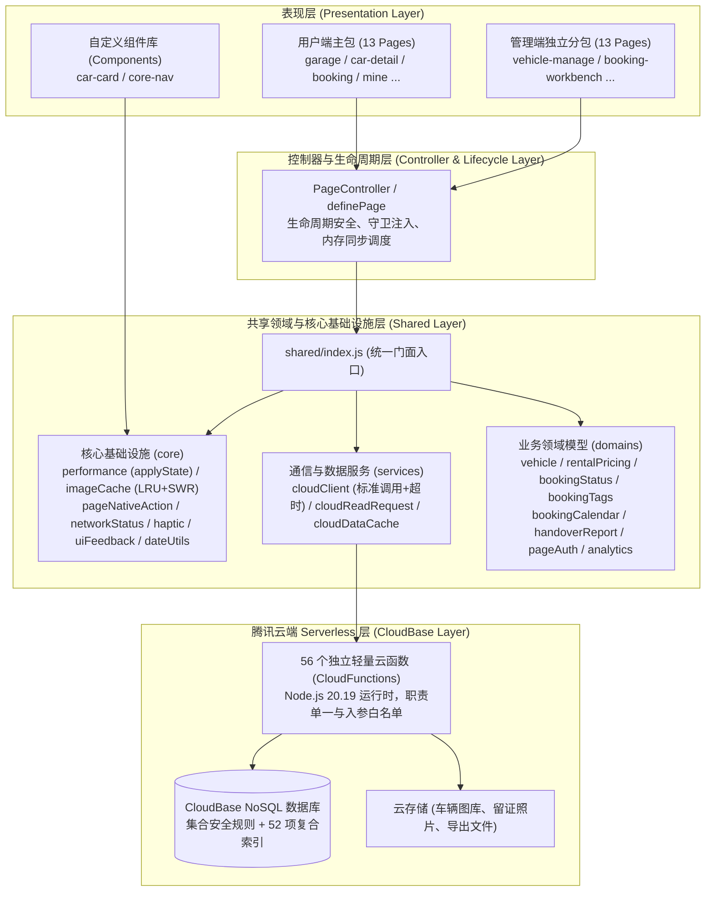

# 极境车库小程序系统架构设计与模块化开发指南
(2826CarPlay Mini-Program System Architecture & Modular Design Guide)

---

## 1. 架构总览与分层拓扑 (Architecture Overview)

本项目采用**微信原生小程序 + 腾讯云开发（CloudBase Serverless）**技术栈构建，严格遵循分层解耦、领域聚合、时序可控和生命周期安全的架构设计哲学。



---

## 2. 模块划分与职责边界 (Modular Boundaries)

### 2.1 目录组织结构

```text
2826carplay/
├── pages/                    # 用户端页面（主包 13 页，严守 1.75 MiB 安全水位）
├── pages-admin/              # 管理端独立分包（13 页，独立打包，按需预载）
├── components/               # 跨页面复用组件 (car-card, core-nav)
├── shared/                   # 共享核心架构库 (高内聚、低耦合)
│   ├── index.js              # 架构统一入口门面 (Barrel Facade)
│   ├── core/                 # 基础底层机制 (性能批处理、两级缓存、时序守卫、日期工具)
│   │   ├── performance.js    # applyState 状态调度与内存同步
│   │   ├── pageNativeAction.js # 微信系统级动作防穿透守卫
│   │   ├── imageCache.js     # LRU + SWR 零闪烁图片预加载
│   │   ├── networkStatus.js  # 弱网监听与重连自愈
│   │   ├── dateUtils.js      # 租期天数计算、区间重叠校验与格式化
│   │   ├── uiFeedback.js     # 统一 Toast 截断与防溢出
│   │   └── hapticFeedback.js # 震动反馈抽象
│   ├── services/             # 数据通信服务
│   │   ├── cloudClient.js    # 标准化云函数通信 (超时控制、统一响应协议)
│   │   ├── cloudReadRequest.js # 只读数据安全请求
│   │   └── cloudDataCache.js # 两级数据缓存
│   ├── domains/              # 业务领域模型 (模型校验、字典枚举、规则状态机)
│   │   ├── vehicle.js        # 车辆规范化与字段校验
│   │   ├── vehicleLabels.js  # 车辆分类、动力、变速箱与状态枚举字典
│   │   ├── rentalPricing.js  # 连租梯度折扣与费用试算
│   │   ├── bookingStatus.js  # 预约单状态机与流转样式
│   │   ├── bookingTags.js    # 客户画像与智能标签
│   │   ├── bookingCalendar.js# 档期日历与冲突排查
│   │   ├── handoverReport.js # 数字交接台账与照片留证
│   │   ├── pageAuth.js       # 管理员角色与鉴权拦截
│   │   └── privacy.js        # 用户数据权利申请与合规状态流转
│   └── pageController.js     # 页面架构控制器 (definePage, createPageController)
├── cloudfunctions/           # 56 个单职责 Serverless 云函数
├── security-rules/           # 数据库与存储集合安全策略
├── scripts/                  # 自动化检查与全量交互仿真脚本
└── __tests__/                # Jest 单元与集成测试套件 (154 Suites)
```

---

## 3. 核心架构设计守卫 (Architectural Guardrails)

系统严格落地 4 大核心安全守卫：

### 3.1 内存同步优先守卫 (Memory Sync Prioritization)
- **问题**：在传统的小程序开发中，异步批处理更新常将数据更新延迟到 `wx.nextTick` 或定时器回调中执行。导致紧随其后的业务函数读取 `this.data` 依然为旧值，引发经典的时序偏差（Timing Bug）。
- **解法**：`createPerformanceHelpers` 与 `applyState` 在调用时，**首先在当前同步微任务内立即通过 `applyPatchToTarget(context.data, patch)` 更新内存数据**，然后再安全推入 `wx.nextTick` 进行视图渲染排期。

### 3.2 异步生命周期与资源泄露防范 (Lifecycle & Teardown Guard)
- **问题**：页面退出或栈回退后，后台未完成的防抖定时器、轮询以及网络恢复监听器依然持有页面引用，导致内存泄漏甚至在已卸载页面触发报错。
- **解法**：`createPageController` 提供统一资源垃圾回收器 (`dispose()`)，页面在 `onUnload` 时一键自动回收所有挂载的防抖器 (`debounce.cancel()`)、排期定时器以及弱网重连监听器。

### 3.3 原生动作切页防穿透 (Native Action Safety Guard)
- **问题**：用户触发微信原生操作（拨号 `makePhoneCall`、拉起相册 `chooseMedia`、操作菜单 `showActionSheet`）后快速点击返回离开页面。异步回调触发时，若继续执行 `this.setData` 将引发后台污染或在无关页面弹出异常弹窗。
- **解法**：通过 `pageNativeAction` 派发代币，在异步回调前必须使用 `isPageNativeActionActive(this, action)` 校验栈顶有效性，失效则静默舍弃。

### 3.4 包体积与性能预算 (Package Footprint Budget)
- **限制**：微信官方主包上限为 2.0 MiB，本项目设定 **1.75 MiB 安全预警水位线**。
- **实施**：管理后台全部功能收敛至 `pages-admin` 独立分包（当前 0.67 MiB），主包体积稳定在 1.22 MiB（留有 0.78 MiB 充裕余量）。

---

## 4. 扩展开发标准范式 (Developer Playbook)

### 4.1 新页面开发：使用 `definePage` 声明式托管

```javascript
const { definePage, callCloud, calculateRentalDays } = require("../../shared")

definePage({
  data: {
    startDate: "2026-10-01",
    endDate: "2026-10-03",
    rentalDays: 3,
    list: []
  },

  onLoad(options) {
    // 页面控制器已自动初始化：
    // - this.applyState 已就绪 (内存同步优先)
    // - 原生动作保护已激活
    this.loadData()
  },

  handleDateChange(e) {
    const { startDate, endDate } = e.detail
    const rentalDays = calculateRentalDays(startDate, endDate)
    // applyState 同步修改 this.data，防抖合并渲染
    this.applyState({ startDate, endDate, rentalDays })
  },

  async loadData() {
    const res = await callCloud("vehicleList", {}, { pageContext: this })
    if (res.ok) {
      this.applyState({ list: res.data })
    }
  }
  // onUnload 自动触发 controller.dispose()，无需手写繁琐的清理逻辑
})
```

### 4.2 云端通信：使用 `callCloud` 统一接口

```javascript
const { callCloud } = require("../../shared/cloudClient")

// 具有生命周期感知、超时控制及异常文案统一解析
const result = await callCloud("bookingCreate", payload, {
  pageContext: this,
  timeoutMs: 15000,
  showErrorToast: true // 出错时自动轻提示
})

if (result.ok) {
  // 业务成功
} else {
  // 结构化错误：result.code, result.message
}
```

### 4.3 业务计算：统一复用 `dateUtils`

```javascript
const { calculateRentalDays, isDateRangeValid, addDays } = require("../../shared/dateUtils")

// 计算包含起止日期的租期天数
const days = calculateRentalDays("2026-10-01", "2026-10-05") // 5

// 校验起止顺序合法性
if (!isDateRangeValid(startDate, endDate)) {
  // 提示日期倒置
}

// 日期推演
const returnDate = addDays(pickupDate, days)
```

---

## 5. 质量防护与自动化验收矩阵 (QA & Verification)

项目内置三层自动化质量防火墙：

| 校验层级 | 命令 | 检查内容 | 当前通过状态 |
| :--- | :--- | :--- | :--- |
| **单元与集成测试** | `npm test` | 154 个测试套件，1833+ 项断言，全覆盖业务逻辑、权限流转与异常回退 | 100% PASS |
| **无头交互仿真** | `npm run simulate:clicks` | 模拟真实小程序运行沙箱，遍历 26 个页面 333+ 项用户交互点击 | 333 / 333 PASS |
| **发布卫生与预算** | `npm run check:release` | 目录结构合规、敏感信息扫描、数据库索引校验、包体积预算 | 全部合规 PASS |
