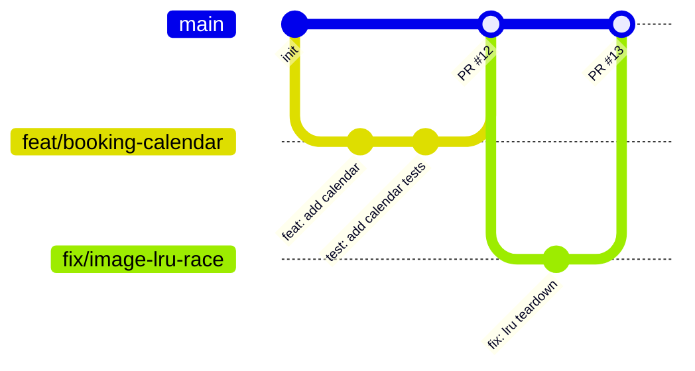

# 极境车库工程贡献与协同开发规范 (Contributing Guidelines)

感谢参与 **极境车库 (JiJing Garage)** 原生微信小程序与腾讯云开发 (CloudBase Serverless) 项目的建设。为保证超跑租赁业务的高可靠性、极速秒开体验与极致工程质量，所有贡献者和 AI 智能体必须遵循以下规范。

---

## 1. 核心开发行为守卫 (Core Guardrails)

代码必须严格遵守以下 4 大运行时架构守卫：

### 1.1 内存同步优先 (Memory-Sync First)
- 在封装或调用状态批处理方法（如 `applyState` 或 `this.setData`）时，**必须在当前执行 tick 内同步更新 `this.data` 内存镜像**，之后再将视图变更推入 `wx.nextTick` 排期更新渲染层。
- 绝不允许出现“渲染层等待异步批量生效，而同步读取 `this.data` 仍为旧数据”的时序缺陷。

### 1.2 搜索输入完整闭环 (Search Completeness)
- 所有带 `confirm-type="search"` 属性的 `<input>` 输入框，必须在 WXML 中同时绑定 `bindinput` 与 `bindconfirm="handleSearchConfirm"`。
- 在 Page 实例中必须实现对应确认回调，立即取消防抖计时器并以最新输入值发起检索，确保软键盘回车即搜即达。

### 1.3 请求参数显式透传 (Explicit Parameter Passthrough)
- 在处理列表分页、排序切换、城市过滤或重置时，`fetchList(params)` 必须支持显式传入参数字典对象 `{ status, keyword, sortBy, city }`。
- 严禁依赖异步状态排期完成后再去隐式读取 `this.data` 发起请求，必须直接透传最新交互参数。

### 1.4 异步生命周期与资源泄露防范 (Lifecycle Teardown & Action Guard)
- 页面与组件中创建的所有防抖句柄、定时器 (`setTimeout` / `setInterval`)、网络监听句柄 (`onNetworkReconnect`)，必须在 `onUnload` 生命周期中执行主动注销与清理。
- 所有微信系统级原生交互异步回调（如 `wx.makePhoneCall`、`wx.chooseMedia`、`wx.showActionSheet`）在执行状态更新前，必须通过 `isPageNativeActionActive` 校验当前页面实例是否依然位于栈顶。

---

## 2. 分支管理与协同流程 (Git Workflow)

本项目采用规范化的 GitHub Flow 分支管理模型：



1. **主干保护**：`main` 为生产基线分支，直接推送受限，所有合并必须经由 Pull Request 并通过质量门禁流水线。
2. **分支命名规约**：
   - 功能开发：`feat/<feature-name>` (例如 `feat/workbench-filters`)
   - 缺陷修复：`fix/<bug-description>` (例如 `fix/date-span-leap-year`)
   - 架构重构：`refactor/<module-name>` (例如 `refactor/booking-status-domain`)
   - 文档调优：`docs/<topic>` (例如 `docs/api-reference-update`)
3. **提交信息规约 (Conventional Commits)**：
   - 格式：`<type>(<scope>): <subject>`
   - 样例：
     - `feat(domain): 新增预约全生命周期阶段指引与进度表现层方法`
     - `fix(booking): 修复跨时区计算租期时的边界进位偏差`
     - `refactor(arch): 抽取 bookingStatus 状态机至 shared 领域层`
     - `test(unit): 补充 bookingStatus 5 阶段进度步进器测试用例`
     - `docs(api): 同步最新 shared 模块导出接口文档`

---

## 3. 代码卫生与规范红线 (Release Hygiene)

所有提交至运行时的客户端与云端代码必须符合以下硬性红线：

1. **零控制台调试语句**：
   - 运行时客户端与云函数代码中严禁残留 `console.log`、`console.info`、`console.debug` 或 `debugger` 语句。
   - 生产环境错误记录统一走合规结构化错误上报。
2. **包体积预算警戒线**：
   - 主包体积硬性上限为 **2.0 MiB**，日常开发警戒线为 **1.75 MiB**（当前主包实际约 1.26 MiB）。
   - 管理后台功能统一收敛至 `pages-admin` 独立分包。
   - 严禁向主包引入未压缩的大体积 PNG/JPG 位图（单图须 <= 100 KB，尽量使用压缩矢量图标或云存储 CDN）。
3. **数据库与安全规则**：
   - 新增集合必须在 `cloudfunctions/common/security-rules/manifest.json` 中配置安全访问规则，并在 `docs/DATABASE_AND_SECURITY.md` 补全字段定义与索引建议。

---

## 4. 本地质量体检门禁 (Quality Gate & Doctor)

在发起 Pull Request 或提交代码前，请在本地运行一键工程质量门禁：

```bash
# 全量 8 阶段深度体检（规范扫描 + 包预算 + 单元测试 + 333次交互仿真 + 30条业务旅程）
node scripts/qualityGate.js

# 快捷静态扫描（前 5 阶段：规范、密钥、草稿、索引、包体积）
node scripts/qualityGate.js --static
```

质量门禁 8 个检查阶段：
1. **项目目录与页面声明规范** (`scripts/checkProjectStructure.js`)
2. **仓库敏感信息与凭据扫描** (`scripts/checkRepositorySecrets.js`)
3. **运营攻略草稿 Schema 校验** (`scripts/contentDraftsValidate.js`)
4. **数据库集合安全规则与索引校验** (`scripts/checkDatabaseIndexes.js`)
5. **小程序主包与分包体积预算** (`scripts/checkMiniProgramPackage.js`)
6. **Jest 自动化测试全量回归** (154 套件，1840+ 用例)
7. **无头全页面组件交互点击仿真** (333 项点击断言)
8. **真实用户全场景业务旅程仿真** (30 项端到端流程)

**门禁健康评分必须达到 100 / 100 分方可允许合并与发布。**
